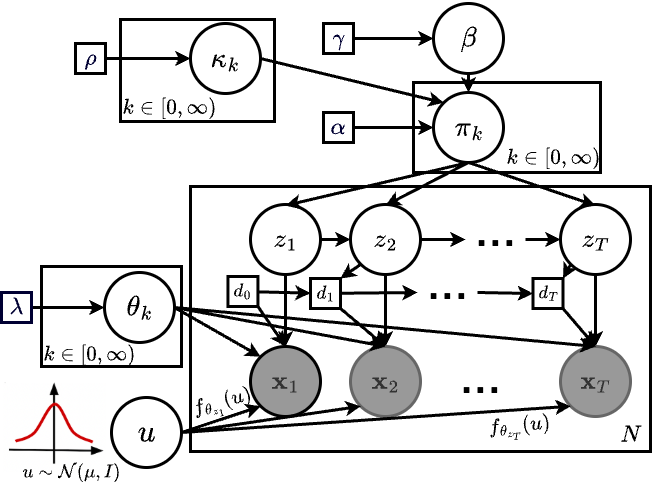

#  HDP-Flow: Generalizable Bayesian Nonparametric Model for Time Series State Discovery

HDP-Flow is a Bayesian nonparametric model that combines normalizing flows with scalable variational inference to uncover evolving latent states in non-stationary time series. The code in this repo enables efficient, unsupervised state discovery and demonstrates strong performance and transferability across diverse real-world datasets. For more details, please refer to our paper []().

<p align="center" style="background-color: #1e1e1e; padding: 20px; border-radius: 10px;">
  
</p>

## Prerequisites

All codes are written for Python 3 (https://www.python.org/) on Linux platform. 

1. Create and activate a virtual environment (recommended):
```
python -m venv venv
source venv/bin/activate
```

2. Install dependencies:
```
pip install -r requirements.txt
```

3. Training the Model:

The dataset-specific model parameters are defined in the [config file](experiment_config.ini), where you can add your datasets and specify the desired training paradigm. You can train the model using a command like the following:

```
python main.py --data sim_easy --train
```

You can use the `--cont` flag to continue training the model from the last saved checkpoint.
Evaluation is automatically performed immediately after training completes.

### Clone this repository
```
git clone https://github.com/sanatonek/HDP-Flow.git
```

## Citation
If you use this code or find our work helpful, please cite:

```bibtex
@inproceedings{tonekabonihdp,
  title={HDP-Flow: Generalizable Bayesian Nonparametric Model for Time Series State Discovery},
  author={Tonekaboni, Sana and Behrouzi, Tina and Weatherhead, Addison and Fox, Emily and Blei, David and Goldenberg, Anna},
  booktitle={The 41st Conference on Uncertainty in Artificial Intelligence}
}

